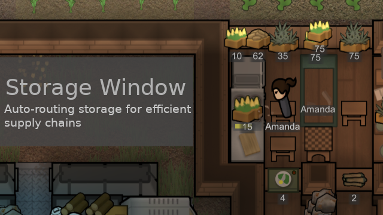

# [PL] Storage Window

A smart pass-through window system for RimWorld that enables seamless item transfer between rooms while maintaining perfect climate separation.



## Overview

The Storage Window mod introduces intelligent pass-through windows that automatically route items to their final storage destinations. These windows act as climate barriers while serving as stepping stones in your colony's supply chain, ensuring items flow efficiently to where they need to go.

## Key Features

### 🔄 **Intelligent Auto-Routing**
- Items don't get stuck in windows - they automatically flow to better storage
- Uses RimWorld's priority system (Critical > Important > Normal > Preferred > Low)
- Smart pathfinding considers distance, filters, and colonist availability

### 🌡️ **Climate Barrier**
- Maintains temperature and atmosphere separation between rooms
- Perfect for keeping cold storage isolated while allowing item transfer
- Blocks wind and weather like a regular wall

### 📦 **Smart Priority System**
- Defaults to "Low" priority to encourage pass-through behavior
- Prefers final storage destinations over transit windows
- Integrates seamlessly with RimWorld 1.6 storage systems

### 🔧 **Auto-Rotation**
- Automatically aligns with wall placement direction
- No manual rotation needed - just place and it works

### 🏷️ **Storage Group Integration**
- Works with RimWorld 1.6 storage group systems
- Compatible with existing storage mods

## How It Works

1. **Initial Placement**: Colonists haul items to storage windows as intermediate storage
2. **Continuous Scanning**: Every second, windows check for better storage options
3. **Automatic Transfer**: When better storage becomes available, colonists automatically move items
4. **Smart Selection**: System considers priority, distance, filters, and colonist availability

### Example Use Cases

- **Kitchen Supply Line**: Raw food flows from freezer → storage window → kitchen
- **Workshop Materials**: Components flow from stockpile → storage window → workshop
- **Medicine Distribution**: Medicine flows from storage → storage window → hospital

## Installation

1. Subscribe to the mod on Steam Workshop
2. Enable in your mod list
3. Start or continue your game

**Requirements:**
- RimWorld 1.6
- No other dependencies required

## Construction

### Materials Required
- 20 Steel
- 1 Component (Industrial)
- Stuff: 20 units (stone, wood, etc.)

### Prerequisites
- Research: Complex Furniture
- Construction Skill: Level 6

## Usage Tips

### Basic Setup
1. Build storage windows in walls between rooms
2. Set up proper storage zones/stockpiles in destination rooms
3. Items will automatically flow through the windows

### Advanced Configuration
- Adjust storage priorities to control flow direction
- Use storage groups to organize complex supply chains
- Combine with other storage mods for enhanced functionality

### Troubleshooting
- Ensure destination storage has higher priority than "Low"
- Check that colonists have clear paths to both sides of the window
- Verify item filters allow the items you want to transfer

## Technical Details

### Performance
- Throttled processing: Only one item per tick to avoid lag
- Efficient algorithms using RimWorld's existing hauling system
- Smart filtering to skip reserved or unreachable items

### Compatibility
- Uses reflection to maintain compatibility with other mods
- Works alongside other storage and hauling mods
- Safe to add/remove from existing saves

## Version History

### v1.0 (Current)
- Initial release for RimWorld 1.6
- Core auto-routing functionality
- Climate barrier implementation
- Smart priority system
- Critical bug fixes for infinite hauling loops

## Known Issues

None currently reported. If you encounter issues, please report them on the Steam Workshop page.

## Development

This mod is actively maintained by ProgrammerLily. The source code follows RimWorld 1.6 best practices and maintains compatibility through careful use of game APIs.

### Building from Source
```bash
dotnet build Source/Project.csproj --configuration Release
```

## Credits

- **Author**: ProgrammerLily
- **Inspired by**: Community requests for better storage flow systems
- **Thanks to**: The RimWorld modding community for feedback and testing

## License

This mod is provided as-is for the RimWorld community. Feel free to learn from the code, but please don't redistribute without permission.

---

**Package ID**: `storagewindow.programmerlily.com`  
**Version**: 1.0  
**RimWorld Version**: 1.6  

For support, questions, or suggestions, visit the Steam Workshop page or the RimWorld modding Discord.